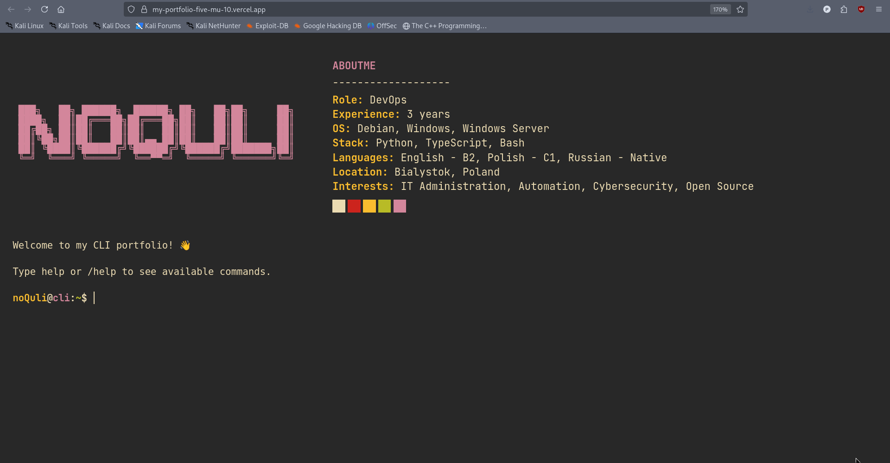

# CLI Portfolio


An interactive terminal-style portfolio built with React, TypeScript, and Vite.

It presents my profile, projects, CV, skills, and contact details through a command-driven interface inspired by a real shell.


## Features

- Terminal-themed portfolio UI
- Command-based navigation with autocomplete
- Built-in command history using the ↑ and ↓ keys
- Theme switching with dark, light, and gruvbox modes
- Data-driven content stored in a single source of truth
- Responsive layout with touch and keyboard support

## Available Commands

Type commands with or without the leading `/`.

| Command | Description |
| --- | --- |
| `/help` | Show all available commands |
| `/aboutme` | Learn about me, my background, and interests |
| `/projects` | View all projects |
| `/portfolio` | View featured projects |
| `/cv` | View the full CV/resume |
| `/contacts` | See contact details |
| `/skills` | View skill categories |
| `/experience` | View work experience |
| `/education` | View education |
| `/socials` | View social links |
| `/theme` | Toggle or set the terminal theme |
| `/clear` | Clear terminal output |
| `/whoami` | Show the current identity banner |
| `/ascii` | Print the ASCII banner |

### Helpful shortcuts

- Press Tab to autocomplete commands
- Use ↑ / ↓ to browse command history
- Click or tap anywhere in the terminal to focus the input

## Tech Stack

- React 19
- TypeScript 5
- Vite
- Tailwind CSS 4
- ESLint
- Vitest

## Getting Started

### Prerequisites

- Node.js 20+ recommended
- npm

### Install dependencies

```bash
npm install
```

### Start the development server

```bash
npm run dev
```

### Build for production

```bash
npm run build
```

### Preview the production build

```bash
npm run preview
```

### Run linting

```bash
npm run lint
```

## Project Structure

- src/components - terminal UI components
- src/commands - command implementations
- src/data/content.ts - all portfolio content
- src/hooks - terminal, theme, and interaction hooks
- src/utils - parsing and tab-completion helpers

## Content Customization

Update [src/data/content.ts](src/data/content.ts) to change the portfolio content:

- About me section
- Projects list
- Work experience
- Education
- Skills
- Contact information
- Social links

## Notes

- Theme preference is saved in localStorage
- The terminal automatically scrolls to the latest output
- Command aliases are supported where defined

## License

This project is licensed under the MIT License. See [LICENSE](LICENSE) for details.
